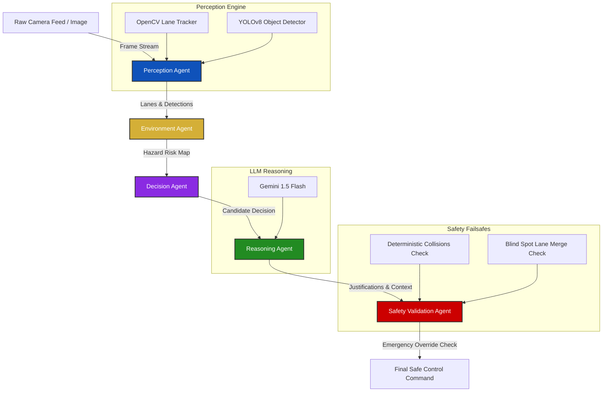

# Agentic Autonomous Driving Assistant (ADAS-Agent)

An industry-grade, multi-agent AI-powered autonomous driving assistant combining Computer Vision (YOLOv8 + OpenCV), Directed Acyclic Graph (DAG) state orchestration (LangGraph), Generative AI explainability (Gemini API), and deterministic Safety Enforcer boundaries.

---

## 🛠️ System Architecture



---

## 📂 Project Directory Structure

```text
agentic_autonomous_driving_assistant/
│
├── agents/
│   ├── __init__.py
│   ├── perception_agent.py      # Core CV pipeline (OpenCV + YOLOv8)
│   ├── environment_agent.py     # Hazard and collision risk scoring
│   ├── decision_agent.py        # Autonomous rule-based action generator
│   ├── reasoning_agent.py       # Gemini API explainability generator
│   └── safety_agent.py          # Deterministic constraint validator
│
├── configs/
│   └── settings.py              # Configurations, thresholds, and variables
│
├── utils/
│   ├── helpers.py               # Pathing and logging utilities
│   └── cv_helpers.py            # Lane detection & bounding box visualization
│
├── data/
│   └── samples/                 # High-fidelity sample images for scenarios
│
├── tests/
│   └── test_agents.py           # Verification suite
│
├── app.py                       # Streamlit UI Dashboard
├── graph.py                     # LangGraph State Machine
├── requirements.txt             # Project dependencies
└── README.md                    # This document
```

---

## 🏁 Installation & Quick Start

### Prerequisites
- Python 3.9+
- A Gemini API Key (Optional; fallback rule engine handles offline scenarios gracefully)

### Step 1: Clone and Set Up Environment
```bash
git clone https://github.com/your-username/agentic-autonomous-driving-assistant.git
cd agentic-autonomous-driving-assistant
python3 -m venv venv
source venv/bin/activate
```

### Step 2: Install Dependencies
```bash
pip install -r requirements.txt
```

### Step 3: Configure Environment Variables
Create a `.env` file in the project folder:
```env
GEMINI_API_KEY=your_actual_gemini_api_key_here
```

### Step 4: Run the Dashboard
```bash
streamlit run app.py
```
Open [http://localhost:8501](http://localhost:8501) in your browser.

---

## 🔍 Technical Deep-Dive

### 1. OpenCV Lane Detection Pipeline
The lane tracking uses a classical CV approach to segment boundary markers:
- **Pre-processing**: Grayscale conversion followed by `GaussianBlur` to filter high-frequency sensor noise.
- **Feature Extraction**: `Canny` Edge Detection identifies pixels corresponding to line markings.
- **ROI Masking**: Apply a trapezoidal mask focusing on the vehicle's driving corridor.
- **Hough Line Transform**: `HoughLinesP` clusters edge pixels into lines. Left lane marks (negative slope) and Right lane marks (positive slope) are filtered and extrapolated to project green overlay lanes.
- **Departure Estimation**: The difference between the frame center (vehicle center) and the lane polygon center is computed to throw directional alerts.

### 2. YOLOv8 Deep Learning Detector
- Object detection runs on `yolov8n.pt` to detect dynamic entities (vehicles, pedestrians) and static traffic signs (stop signs, lights).
- Distance is estimated dynamically using the inverse relationship of object height and perspective:
  $$Distance = \frac{Calibration Factor}{Bounding Box Height Fraction}$$

### 3. Agent Coordination (LangGraph)
- State transitions are coordinated as a directed sequence.
- State schema retains raw frames, OpenCV drawings, object lists, calculated hazards, and explanations.

### 4. Safety Validation (Failsafe Guard)
- Generative AI models are subject to hallucinations, latency, or API disconnects.
- To achieve industry-grade reliability, the final control command must pass a **deterministic enforcer** checking immediate constraints (proximity boundaries, blind spot occupancy) before emitting steering commands.

---

## 🧪 Verification & Testing Strategy
Run unit tests to verify agent state transitions and override correctness:
```bash
python3 -m unittest discover -s tests
```

---
